# Data Warehouse Build Report

Generated: 2026-10-07T08:07:09.085269Z

## Schema Overview

```mermaid
erDiagram
    %% =========================
    %% DIMENSIONS
    %% =========================
    dw_dim_date {
      INT date_key PK "yyyymmdd"
      DATE date_actual
      SMALLINT year
      SMALLINT quarter
      SMALLINT month
      SMALLINT day
      SMALLINT week_of_year
      SMALLINT day_of_week
      BOOLEAN is_weekend
    }
 
    dw_dim_customer {
      BIGINT customer_sk PK
      VARCHAR customer_id
      VARCHAR country
      VARCHAR state
      VARCHAR customer_segment
      BOOLEAN is_logged_in
      TIMESTAMP effective_from
      TIMESTAMP effective_to
      BOOLEAN is_current
    }
 
    dw_dim_product {
      BIGINT product_sk PK
      VARCHAR product_id
      VARCHAR category
      VARCHAR price_bucket
      DECIMAL current_unit_price_usd
      TIMESTAMP effective_from
      TIMESTAMP effective_to
      BOOLEAN is_current
    }
 
    dw_dim_campaign {
      BIGINT campaign_sk PK
      VARCHAR campaign
    }
 
    dw_dim_channel {
      BIGINT channel_sk PK
      VARCHAR channel
    }
 
    dw_dim_device {
      BIGINT device_sk PK
      VARCHAR device_type
    }
 
    dw_dim_browser {
      BIGINT browser_sk PK
      VARCHAR browser
    }
 
    dw_dim_os {
      BIGINT os_sk PK
      VARCHAR os
    }
 
    dw_dim_referrer {
      BIGINT referrer_sk PK
      VARCHAR referrer
    }
 
    dw_dim_shipping_method {
      BIGINT shipping_method_sk PK
      VARCHAR shipping_method
    }
 
    dw_dim_payment_method {
      BIGINT payment_method_sk PK
      VARCHAR payment_method
    }
 
    dw_dim_ab_variant {
      BIGINT ab_variant_sk PK
      VARCHAR ab_variant
    }
 
    %% =========================
    %% FACTS
    %% =========================
    dw_fact_orders {
      BIGINT order_sk PK
      VARCHAR order_id
      BIGINT customer_sk FK
      INT order_date_key FK
      INT ship_date_key FK
      BIGINT channel_sk FK
      BIGINT device_sk FK
      BIGINT browser_sk FK
      BIGINT campaign_sk FK
      BIGINT payment_method_sk FK
      BIGINT shipping_method_sk FK
      VARCHAR primary_category
      INT num_distinct_items
      DECIMAL subtotal_usd
      DECIMAL discount_rate
      DECIMAL discount_amount_usd
      DECIMAL shipping_cost_usd
      DECIMAL tax_rate
      DECIMAL tax_amount_usd
      DECIMAL order_total_usd
      DECIMAL order_weight_kg
      INT delivery_days
      BOOLEAN on_time_delivery
      BOOLEAN authorization_approved
      BOOLEAN returned
    }
 
    dw_fact_events {
      BIGINT event_sk PK
      VARCHAR event_id
      BIGINT customer_sk FK
      BIGINT product_sk FK
      INT event_date_key FK
      VARCHAR session_id
      VARCHAR event_type
      BIGINT channel_sk FK
      BIGINT device_sk FK
      BIGINT browser_sk FK
      BIGINT os_sk FK
      BIGINT referrer_sk FK
      BIGINT ab_variant_sk FK
      INT page_depth
      INT latency_ms
      INT dwell_seconds
      DECIMAL cart_value_usd
      DECIMAL discount_rate
      DECIMAL fraud_score
      VARCHAR payment_outcome
      INT sequence_num
      VARCHAR category
      VARCHAR promo_code
    }
 
    dw_fact_graph_edges {
      BIGINT edge_sk PK
      VARCHAR edge_id
      INT event_date_key FK
      VARCHAR relationship
      BIGINT from_customer_sk FK
      BIGINT to_customer_sk FK
      BIGINT from_product_sk FK
      BIGINT to_product_sk FK
      VARCHAR order_id
      VARCHAR category
      BIGINT campaign_sk FK
      VARCHAR customer_segment
      VARCHAR region
      VARCHAR state
      DECIMAL edge_strength
      VARCHAR price_bucket
      INT prior_interactions
      INT dwell_seconds
      DECIMAL unit_price_usd
      INT quantity
      BOOLEAN returned_flag
      BOOLEAN auth_approved
    }
 
    %% =========================
    %% RELATIONSHIPS
    %% (|o = zero or one, i.e. nullable FK)
    %% =========================
    dw_dim_date ||--o{ dw_fact_orders : "order_date_key"
    dw_dim_date |o--o{ dw_fact_orders : "ship_date_key"
    dw_dim_date ||--o{ dw_fact_events : "event_date_key"
    dw_dim_date ||--o{ dw_fact_graph_edges : "event_date_key"
 
    dw_dim_customer ||--o{ dw_fact_orders : "customer_sk"
    dw_dim_customer ||--o{ dw_fact_events : "customer_sk"
    dw_dim_customer |o--o{ dw_fact_graph_edges : "from_customer_sk"
    dw_dim_customer |o--o{ dw_fact_graph_edges : "to_customer_sk"
 
    dw_dim_product ||--o{ dw_fact_events : "product_sk"
    dw_dim_product |o--o{ dw_fact_graph_edges : "from_product_sk"
    dw_dim_product |o--o{ dw_fact_graph_edges : "to_product_sk"
 
    dw_dim_campaign ||--o{ dw_fact_orders : "campaign_sk"
    dw_dim_campaign ||--o{ dw_fact_graph_edges : "campaign_sk"
 
    dw_dim_channel ||--o{ dw_fact_orders : "channel_sk"
    dw_dim_channel ||--o{ dw_fact_events : "channel_sk"
 
    dw_dim_device ||--o{ dw_fact_orders : "device_sk"
    dw_dim_device ||--o{ dw_fact_events : "device_sk"
 
    dw_dim_browser ||--o{ dw_fact_orders : "browser_sk"
    dw_dim_browser ||--o{ dw_fact_events : "browser_sk"
 
    dw_dim_os ||--o{ dw_fact_events : "os_sk"
    dw_dim_referrer ||--o{ dw_fact_events : "referrer_sk"
    dw_dim_ab_variant ||--o{ dw_fact_events : "ab_variant_sk"
 
    dw_dim_shipping_method ||--o{ dw_fact_orders : "shipping_method_sk"
    dw_dim_payment_method ||--o{ dw_fact_orders : "payment_method_sk"
```



### Staging Tables
| Table | Rows |
|---|---:|
| `stg_orders_raw` | 2,500 |
| `stg_events_raw` | 2,500 |
| `stg_edges_raw` | 2,500 |

### Fact Tables
| Table | Rows |
|---|---:|
| `dw_fact_orders` | 2,500 |
| `dw_fact_events` | 2,500 |
| `dw_fact_graph_edges` | 2,500 |

### Dimension Tables
| Table | Rows |
|---|---:|
| `dw_dim_date` | 552 |
| `dw_dim_customer` | 7,057 |
| `dw_dim_product` | 3,360 |
| `dw_dim_campaign` | 7 |
| `dw_dim_channel` | 5 |
| `dw_dim_device` | 3 |
| `dw_dim_browser` | 5 |
| `dw_dim_os` | 5 |
| `dw_dim_referrer` | 6 |
| `dw_dim_shipping_method` | 3 |
| `dw_dim_payment_method` | 5 |
| `dw_dim_ab_variant` | 2 |

## Design Rationale

1. **Star schema.** Three facts at different grains (orders, events, graph edges) share conformed dimensions
   (customer, product, date, campaign, device, browser). Analysts can slice any fact by the same attributes,
   and joins stay one hop from fact to dimension.
2. **Distribution keys.** `fact_orders` and `fact_events` use `DISTKEY(customer_sk)` so customer-centric joins and
   aggregations are collocated. `fact_graph_edges` uses `DISTKEY(to_product_sk)` for product-centric analysis.
   Small lookup dimensions use `DISTSTYLE ALL` so they are broadcast to every node and joins need no shuffling.
3. **Sort keys.** Every fact is sorted on its date key (`order_date_key`, `event_date_key`), so time-range filters
   skip blocks via zone maps. `dim_date` is sorted on `date_key`; customer and product dimensions on their surrogate keys.
4. **SCD2-ready dimensions.** `dim_customer` and `dim_product` carry `effective_from`, `effective_to` and `is_current`;
   fact loads join on `is_current = TRUE`.
5. **Materialized view.** `dw_mv_daily_revenue` pre-aggregates orders, revenue and average order value per day,
   so dashboards read a small table instead of scanning `fact_orders`.

## Analytics Capabilities

- Revenue, order volume and average order value over time (daily, by weekday, by quarter via `dim_date`)
- Revenue and orders by channel, campaign, device, browser, payment and shipping method
- Delivery performance and returns (`on_time_delivery`, `delivery_days`, `returned`)
- Clickstream and funnel analysis by event type, session, device, referrer and A/B variant
- Product relationship analysis from graph edges (customer-to-product and product-to-product)

## Performance Findings

### Distribution and sort keys applied
```
            table_name diststyle       distkey       sortkey1  tbl_rows applied
     dw_dim_ab_variant       ALL           NaN            NaN         2       ✓
        dw_dim_browser       ALL           NaN            NaN         5       ✓
       dw_dim_campaign       ALL           NaN            NaN         7       ✓
        dw_dim_channel       ALL           NaN            NaN         5       ✓
       dw_dim_customer       KEY   customer_sk    customer_sk      7057       ✓
           dw_dim_date       ALL           NaN       date_key       552       ✓
         dw_dim_device       ALL           NaN            NaN         3       ✓
             dw_dim_os       ALL           NaN            NaN         5       ✓
 dw_dim_payment_method       ALL           NaN            NaN         5       ✓
        dw_dim_product       ALL           NaN     product_sk      3360       ✓
       dw_dim_referrer       ALL           NaN            NaN         6       ✓
dw_dim_shipping_method       ALL           NaN            NaN         3       ✓
        dw_fact_events       KEY   customer_sk event_date_key      2500       ✓
   dw_fact_graph_edges       KEY to_product_sk event_date_key      2500       ✓
        dw_fact_orders       KEY   customer_sk order_date_key      2500       ✓
```

### Materialized view vs. base fact table
The same daily-revenue aggregation, run 5 times per source with the result cache bypassed
(server-side elapsed time from `sys_query_history`):

```
           source  runs  avg_ms  min_ms
       fact table     5    55.5     3.7
materialized view     5    44.1     3.5
```

Average: fact table 55.5 ms vs materialized view 44.1 ms
(**1.3x** faster). `ANALYZE` was run on all fact and dimension tables after loading.

## Sample Query Results

### Daily revenue (first 10 days)
```sql
SELECT d.date_actual, mv.revenue_usd, mv.orders, mv.avg_order_value
FROM public.dw_mv_daily_revenue mv
JOIN public.dw_dim_date d ON d.date_key = mv.order_date_key
ORDER BY d.date_actual
LIMIT 10;
```

```
date_actual revenue_usd  orders avg_order_value
 2024-01-01     4086.97       6          681.16
 2024-01-02     2150.01       5          430.00
 2024-01-03      681.74       6          113.62
 2024-01-04      731.67       3          243.89
 2024-01-05     1302.17       4          325.54
 2024-01-06     4421.65       9          491.29
 2024-01-07     2293.13       5          458.62
 2024-01-09     1712.60       6          285.43
 2024-01-10     2472.00       8          309.00
 2024-01-11     4127.43       6          687.90
```

### Revenue by channel
```sql
SELECT ch.channel, COUNT(*) AS orders, SUM(f.order_total_usd) AS revenue_usd
FROM public.dw_fact_orders f
JOIN public.dw_dim_channel ch ON ch.channel_sk = f.channel_sk
GROUP BY ch.channel
ORDER BY revenue_usd DESC;
```

```
    channel  orders revenue_usd
android_app     535   224060.04
    ios_app     498   221419.83
        web     500   205995.94
marketplace     490   199147.95
 mobile_web     477   188793.93
```

### Events by type
```sql
SELECT event_type, COUNT(*) AS events, COUNT(DISTINCT customer_sk) AS customers
FROM public.dw_fact_events
GROUP BY event_type
ORDER BY events DESC;
```

```
      event_type  events  customers
    product_view     696        693
       page_view     641        636
     add_to_cart     480        479
  checkout_start     259        259
 payment_attempt     218        218
        purchase     155        155
return_initiated      51         51
```
